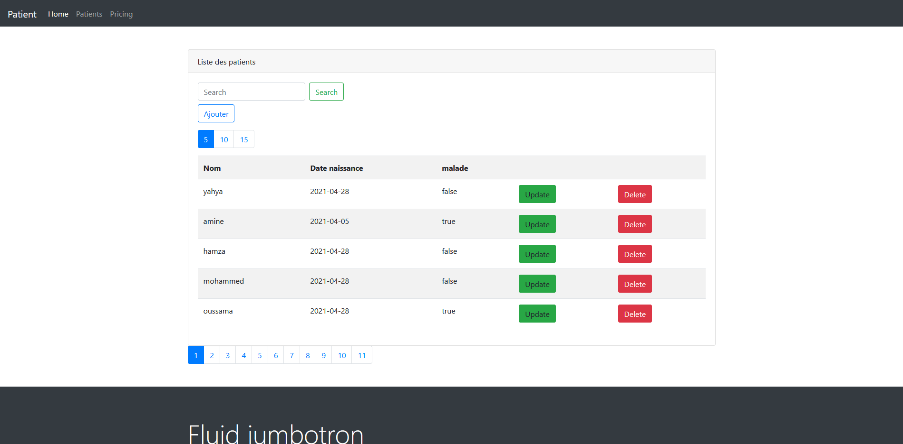
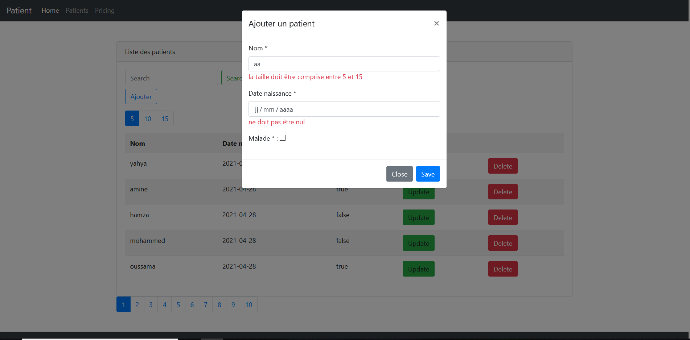
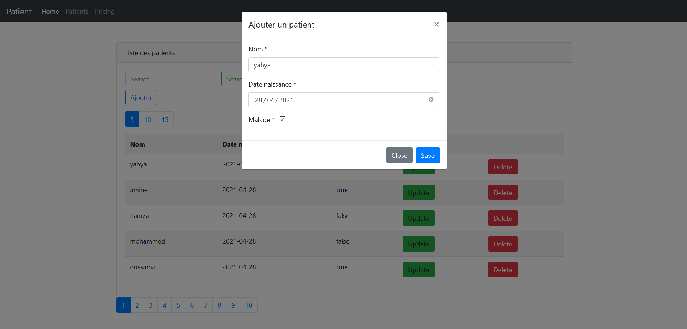

#Gestion des patients
##Liste des patients

on peut consulter la liste des patients avec un systeme de 
pagination et avec une recherche par mot cle et on peut aussi
changer le nombre de patient afficher par page par 5, 10, 15

##Ajout et validation du formulaire
lorsqu'on click sur le button ajouter un modal est ouvert avec un 
formulaire à remplire pour l'ajout d'un nouveau patient.
apres l'envoi du formulaire les informations saisie sont alors 
verifier si tout va bien le patient sera enregistrer dans la base de
donnees sinon les messages d'erreur seron afficher dans le formulaire

##Modification d'un patient
lorsqu'on click sur le button update une requête ajax est envoyer au
serveur pour recuperer le patient concerner et l'afficher dans le
formulaire pour le modifier (son id est stocker dans un input hidden)

##Suppresion d'un patient
lorsqu'on click sur le button delete le patient concerner est supprimer
